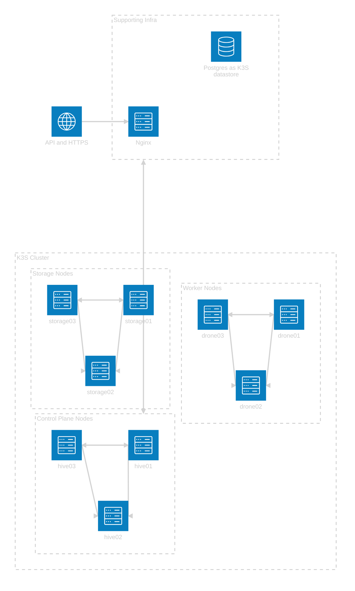

# k3s-proxmox-automation

## Overview
This project provides the capability to quickly setup a highly-available (HA) K3S cluster with Proxmox. The general architecture can be seen below:



It uses various methods and tools to achieve this automation. Some of them are listed below:
- Terraform
- Ansible
- Cloud Init

## General Structure
### Terraform
Using the [BPG terraform provider](https://registry.terraform.io/providers/bpg/proxmox/latest) the plan provisions the following resources:
- Nginx VM
  - Acts as a load balancer for the control plane nodes
- Postgres VM
  - K3S cluster datastore
- Hive VM x3
  - Control plane nodes
- Drone VM x3
  - Worker nodes
- Storage VM x3
  - Worker nodes specifically for storage use
- Cloud Init Image
  - Ubuntu Cloud Init ISO
- Cloud Init Config Snippet
  - Config to install the qemu-guest-agent during provisioning
- Null Resource: Main purpose is to update Nginx if control plane nodes are added/removed

The VM terraform resource blocks all have a `local-exec` provisioner associated that calls a shell script that provides a nice wrapper for a few ansible playbooks.

### Ansible
All VM resources are initially configured using the [baseline-setup.yaml](ansible/baseline-setup.yaml) playbook. This playbook performs essential tasks such as updating and upgrading packages, installing Fail2ban, and hardening SSH settings.

Once the baseline configuration is applied, a purpose-specific playbook is executed for each VM. The table below outlines each VM, its corresponding playbook, and its specific purpose.

| Virtual Machine | Playbook                                                 | Purpose                                                                                                                                |
| --------------- | -------------------------------------------------------- | -------------------------------------------------------------------------------------------------------------------------------------- |
| Nginx           | [nginx-setup.yaml](ansible/nginx-setup.yaml)             | Installs nginx and configures nginx.conf with upstream listeners for kubeapi traffic and https traffic for the control plane           |
| Postgres        | [postgres-setup.yaml](ansible/postgres-setup.yaml)       | Installs postgres and configures k3s user, database and network access                                                                 |
| Hive            | [k3s-hive-setup.yaml](ansible/k3s-hive-setup.yaml)       | Installs K3S server using the nginx load balancer with node taints to prevent workload execution                                       |
| Drone           | [k3s-drone-setup.yaml](ansible/k3s-drone-setup.yaml)     | Installs K3S agent using the nginx load balancer                                                                                       |
| Storage         | [k3s-storage-setup.yaml](ansible/k3s-storage-setup.yaml) | Installs K3S agent using the nginx load balancer with node taint to indicate storage only, configures additional disk for longhorn use |

## Considerations
There are a few assumptions that are made that allow for the deployment to be successful:
- An SSH key is generated for cloud init
- The Proxmox storage target supports `Snippets` and `ISO images`
- The VM ID's and IP addresses you choose are available
- The Proxmox account has root access
- There is s3 comopatible storage available (this can be adjusted to using local storage)

## Getting Started
1. Clone this repository
```bash
git clone git@github.com:port-43/k3s-proxmox-automation.git
```
2. Navigate to the terraform directory
```bash
cd tf/
```
3. Rename `backend.example.tfvars` to `backend.tfvars`
```bash
mv backend.example.tfvars backend.tfvars
```
4. Populate the `backend.tfvars` vars with the relevant values
5. Initiate the terraform project
```bash
terraform init -backend-config backend.tfvars
```
6. Rename `terraform.example.tfvars` to `terraform.tfvars`
7. Populate the `terraform.tfvars` vars with the relevant values
8. Run the terraform plan
```bash
terraform plan --out <plan name>
```
9. Apply the terraform plan
```bash
terraform apply "<plan name>"
```
10. After all resources are complete you should find two files underneath `ansible/k3s/`
    - `k3s.yaml`: This holds the kube config retrieved from the control plane node
    - `node-token`: The node token used to join additional nodes
11. Verify your k3s cluster
```bash
kubectl --kubeconfig ansible/k3s/k3s.yaml get nodes
```
